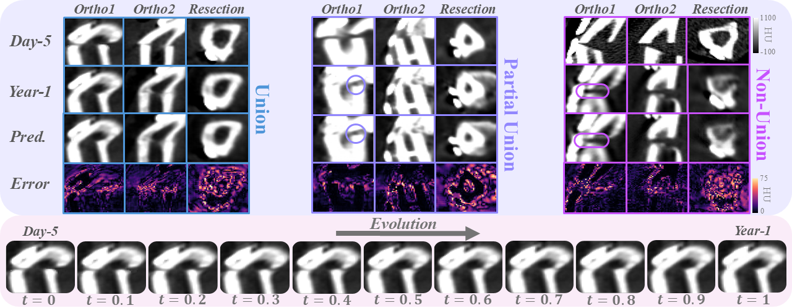

# OsteoFlow: Lyapunov-Guided Flow Distillation for Predicting Bone Remodeling after Mandibular Reconstruction

OsteoFlow is a two-stage teacher–student framework for predicting Year-1 post-operative CT from Day-5 CT after mandibular reconstruction. The method combines diffeomorphic registration and rectified flow modeling to learn bone remodeling dynamics at the graft–host interface.

During training, a registration-based teacher provides deformation trajectory supervision, while the student learns an image-space transport field regularized with an analytical Lyapunov constraint. At inference time, only the student model is required.

## Overview

Mandibular bone remodeling after reconstruction is complex and highly patient-specific. OsteoFlow addresses this problem using a teacher–student learning strategy. The teacher model learns diffeomorphic registration-based trajectories using stationary velocity fields (SVF), and the student model distills these trajectories into a rectified flow formulation. A Lyapunov-guided constraint promotes stable and meaningful training dynamics. Inference is performed using only the student model, allowing efficient prediction.

## Repository Components

| Component | Description | Entry Point |
|---|---|---|
| Teacher (SVF) | Diffeomorphic registration model used to generate supervision trajectories during training | `Code/OsteoFlow_Teacher_V0.py` |
| Student (Rectified Flow + Lyapunov) | Student model trained with rectified flow, Lyapunov regularization, and resection-aware supervision | `Code/OsteoFlow_Student_V0.py` |

## Method Summary

The proposed framework consists of two stages.

### 1. Teacher stage
- Learns deformation trajectories between Day-5 and Year-1 CT volumes
- Uses a registration-based formulation with stationary velocity fields

### 2. Student stage
- Learns an image-space rectified flow from teacher-generated supervision
- Incorporates Lyapunov-guided regularization
- Supports joint or selective optimization through configurable loss modes

At test time, the teacher is not needed.

## Configurable Parameters and Flags

The parameters and flags in the code can be adjusted depending on the experiment setup.

In particular, `LOSS_MODE` controls the optimization setting in the student model:

- `fm_only` — use only rectified flow
- `lqr_only` — use only Lyapunov-guided teacher supervision
- `both` — use the joint formulation

Example:

```python
# The parameters and flags in this code can be adjusted depending on the training setup.
# LOSS_MODE controls which supervision is used:
#   'fm_only'  -> rectified flow only
#   'lqr_only' -> Lyapunov-guided teacher only
#   'both'     -> joint training
LOSS_MODE = 'both'  # 'both' | 'lqr_only' | 'fm_only'
```

## Figures

The figures below correspond to the Methods and Results sections of the accompanying paper.

### Figure 1 — Method


Preprocessing and the teacher–student distillation framework used to guide the student velocity field.

### Figure 2 — Results


Model predictions for three representative cases (union, partial union, and nonunion), visualized on the resection plane and two orthogonal central slices.

## Checkpoints and Data

Pretrained checkpoints will be released and linked here.

The dataset used in this study is internal and cannot be publicly distributed. In the case of acceptance, access requests may be directed to the corresponding author.

## Installation

Install dependencies with:

```bash
pip install -r requirements.txt
```

## Usage

Run the teacher model:

```bash
python Code/OsteoFlow_Teacher_V0.py
```

Run the student model:

```bash
python Code/OsteoFlow_Student_V0.py
```

## Repository Structure

```text
OsteoFlow/
│
├── README.md
├── requirements.txt
├── Code/
│   ├── OsteoFlow_Teacher_V0.py
│   └── OsteoFlow_Student_V0.py
│
├── assets/
│   ├── method.png
│   └── results.png
```

## Reproducibility Notes

- If file paths are modified, keep directory names consistent under `BASE_DIR`.
- The teacher model is used only during training for trajectory distillation.
- Inference uses the student model alone.
- This design enables efficient prediction of Year-1 remodeling from Day-5 CT inputs.

## Citation

If you use this repository in your research, please cite the corresponding paper once available.

```bibtex
@article{osteoflow2026,
  title={OsteoFlow: Lyapunov-Guided Flow Distillation for Predicting Bone Remodeling after Mandibular Reconstruction},
  author={Anonymous},
  journal={Under review},
  year={2026}
}
```

## Notes

This repository is intended as the reference implementation of OsteoFlow. Additional documentation, pretrained weights, and usage details will be added as the project evolves.
